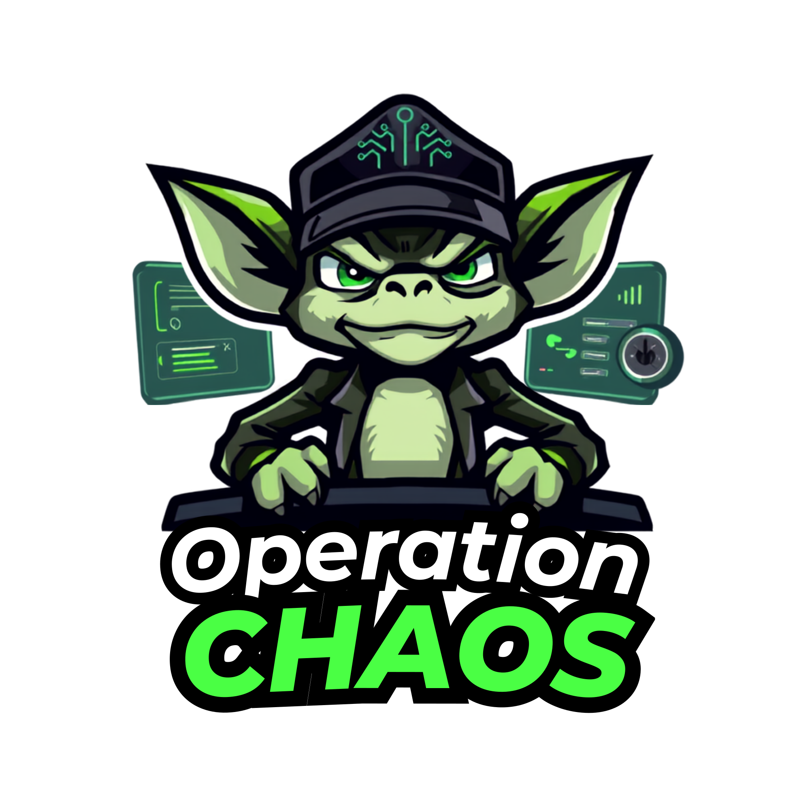

# Operation Chaos

  

---

# Description

Operation Chaos is the real time SRE challenge game designed to be a playground or gym for SRE to hone their skill and practices.

# Assessments

## Table of Contents

1. [Assessment 1: High-Level Design for the Score Entry System on AWS (Part 1)](#assessment-1-high-level-design-for-the-score-entry-system-on-aws-part-1)

Operation Chaos will be a real, running game by the end of Advanced Platform Engineering Batch 1, but only through your own effort. The platform is built assessment by assessment across the batch, and each one delivers both knowledge and real-world experience. Every assessment will challenge you on system design, deployment, operations, networking, reliability, and platform engineering.

## Assessment 1, High-Level Design for the Score Entry System on AWS (Part 1)

### Context

Operation Chaos is built from several microservices. This assessment covers two of
them: the **Score Entry System**.

The functional requirements are deliberately small, because this assessment is not
about features. It is about scaling decisions, and the reasoning behind them.

**Service A: Score Ingest API**
A TypeScript WebSocket service. Clients connect and stream score events during a
live match. The service accepts those events and publishes them to Redis. Clients
also receive score updates over the same socket.

**Service B: Redis**
Self-managed on EC2. Acts as the coupling boundary between ingest and broadcast
via Redis Streams. No ElastiCache, how Redis scales is your problem, and that is
the point.

That is the entire application. If it feels too simple, you have not yet found the
hard part.

---

### Scenario constraints

Design against these numbers. They are not decoration, your decisions must be
defensible against them, and a design that ignores them will not pass.

| Constraint | Value |
|---|---|
| Baseline load | ~4,000 concurrent connections |
| Peak load | 50,000+ concurrent connections |
| Availability target | 99.5% during match windows |
| Platform | Self-managed on EC2. No managed data stores. |
| Region | Single region, minimum 2 Availability Zones |

---

### Your task

For **each** of the two services, decide whether it scales **vertically** or
**horizontally**, and defend that decision in an ADR.

You must also choose and justify the load balancer for the ingest path. AWS offers
more than one option that will technically work. Explain why you chose the one you
chose, and what you gave up by not choosing the other. Also you must choose right EC2 instance category and instance types for each service with solid reason of why you choose them

---

### Deliverable, Architecture Decision Record + AWS Diagram

Use the standard ADR format. Minimum sections:

1. **Title and status**
2. **Context**: The problem, the constraints that bind, and the assumptions you
   are making where the scenario is silent. State your assumptions explicitly;
   an unstated assumption is a hidden defect.
3. **Decision**: Vertical or horizontal, per service, stated plainly. Which load
   balancer you chose, why you chose it, and what you gave up by rejecting the
   alternative. Your EC2 choices in detail: instance family, size, and what
   characteristic of the workload drove that pick.
4. **Options considered**: At least two per service, including the one you
   rejected. A rejected option with no analysis is not an option considered.
5. **Consequences**: What this decision costs you. Every scaling decision buys
   something and pays for something. Name both.
6. **AWS Architecture Diagram**: The target architecture, with every boundary
   drawn and every component labelled. Unlabelled boxes are not a diagram.
