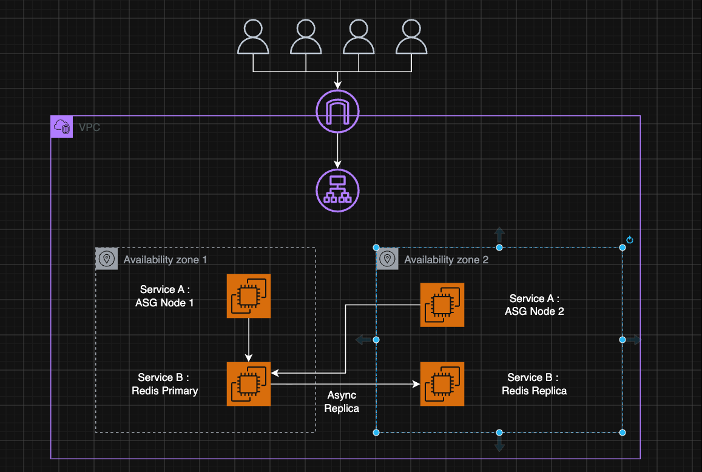

# ADR 001: Scaling Strategy and Instance Selection for Score Entry System

## 1. Title and status

**Title:** Scaling Strategy and Instance Selection for Score Entry System  
**Status:** Proposed

## 2. Context

Operation Chaos is a real-time game requiring a Score Entry System with the following constraints:

- **Baseline Load:** ~4,000 concurrent connections.
- **Peak Load:** 50,000+ concurrent connections.
- **Availability Target:** 99.5% during match windows.
- **Platform:** Self-managed on EC2 (no managed data stores). Single region, minimum 2 Availability Zones (AZs).
- **Service A (Score Ingest API):** TypeScript WebSocket service processing live match data.
- **Service B (Redis):** Acts as the pub/sub decoupling layer.
- **Operating System:** Ubuntu Linux.

_Assumptions:_

- Websocket clients require persistent connections for the duration of a match.
- Redis will primarily be constrained by memory to hold active match data and pub/sub queues.

## 3. Decision

### Load Balancer: Application Load Balancer (ALB)

We will use an **AWS Application Load Balancer (ALB)**.

- **Why:** The ALB natively supports WebSocket upgrades and persistent connections. Furthermore, it supports **Layer 7 sticky sessions**, which guarantees that clients interacting with temporary socket state will be routed to the correct backend node during reconnects.
- **What we gave up:** By rejecting the Network Load Balancer (NLB), we give up extreme raw TCP throughput and ultra-low latency, but the NLB lacks Layer 7 cookie-based sticky sessions.

### Service A (Score Ingest API): Horizontal Scaling

- **Decision:** Scale **Horizontally** across multiple Availability Zones using an Auto Scaling Group (ASG).
- **EC2 Choice:** `t3.medium` or `m5.large` (General Purpose, x86).
- **Why:** The service needs to scale dynamically from 4,000 to 50,000+ users. Horizontal scaling ensures we can spin up additional EC2 instances during peak loads and scale down to save costs during the baseline load. The ingest API primarily passes messages without heavy computation, meaning CPU/Memory requirements are balanced. General-purpose x86 instances are cost-effective, standard, and highly available.

### Service B (Redis): Vertical Scaling

- **Decision:** Scale **Vertically** with a Primary-Replica setup across 2 AZs for high availability.
- **EC2 Choice:** `r5.large` or higher (Memory Optimized, x86).
- **Why:** Redis is an in-memory datastore and single-threaded. Horizontal scaling (Redis Cluster) introduces massive operational complexity on the client and server sides. A single vertically scaled instance with enough RAM can easily process 100,000+ operations per second. Memory-optimized instances are specifically designed for this cache-heavy workload.

## 4. Options considered

- **Load Balancer:** Network Load Balancer (NLB). Rejected because it relies on IP-based stickiness rather than cookie-based stickiness, which behaves poorly if many users are behind a single corporate NAT or mobile provider.
- **Service A Scaling:** Vertical scaling. Rejected because provisioning a single massive server to handle 50,000 connections is expensive during the 4,000 connection baseline. Furthermore, a single instance violates the 99.5% availability and 2 AZ constraint (a single node failure would cause a total outage).
- **Service B Scaling:** Horizontal scaling (Redis Cluster). Rejected because the operational overhead of managing a sharded Redis cluster on raw EC2 instances is too high and unnecessary for 50k concurrent users, which vertical scaling can easily handle.
- **Compute Architecture:** ARM/Graviton instances (`t4g`/`r6g`). Rejected because standard x86 (`t3`/`m5`/`r5`) is widely understood, standard across the industry, and requires no validation for existing operational tools, reducing cognitive load.

## 5. Consequences

- **ALB Cost:** ALB pricing per LCU is slightly higher than NLB, and latency is marginally increased due to Layer 7 inspection.
- **Horizontal Service A:** Auto Scaling takes a few minutes to boot new instances. We must carefully configure scaling metrics (e.g., active connection count) to scale _before_ the peak hits, and handle connection draining gracefully when scaling down.
- **Vertical Service B:** If the primary Redis instance crashes, there will be a brief disruption while the system fails over to the replica in the second AZ, slightly eating into the 99.5% error budget.

## 6. AWS Architecture Diagram

